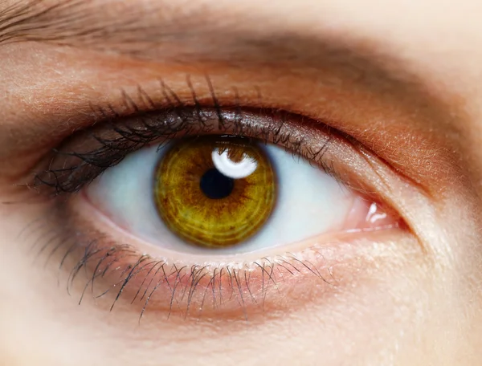
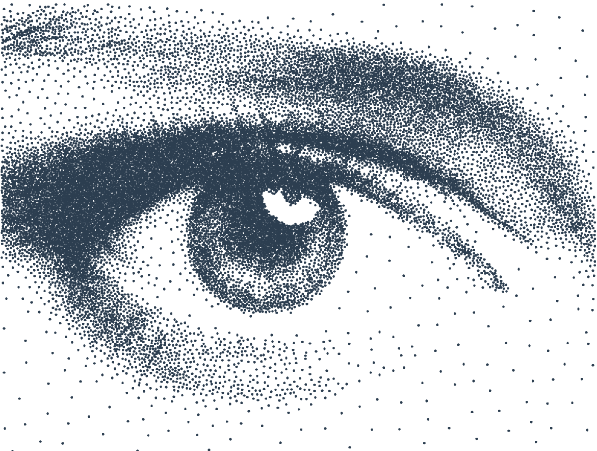
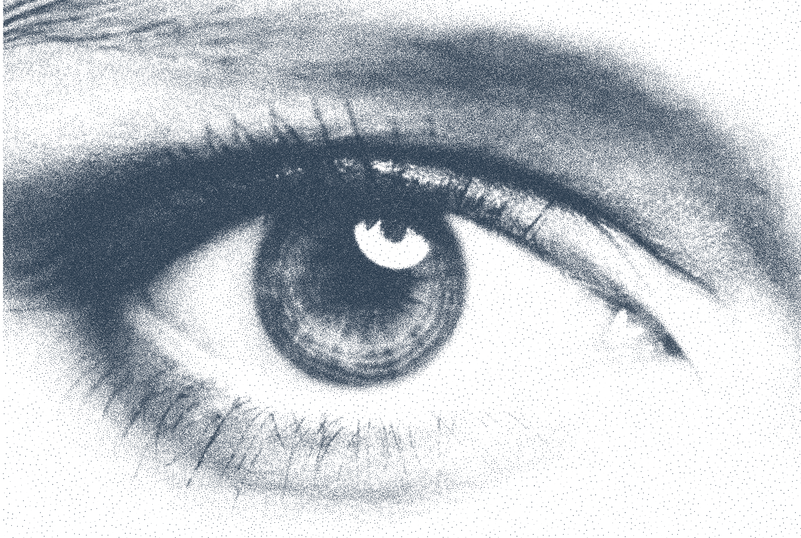
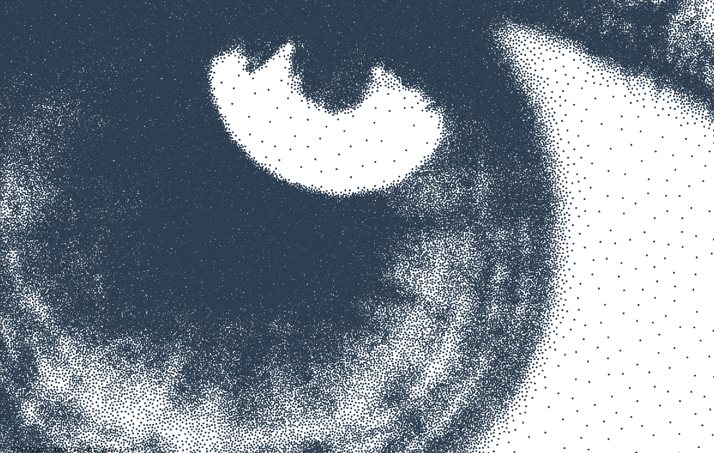

# image_dots

Processing sketch that converts an image into a point cloud using **variable-density Poisson Disk Sampling**.

---

## Examples

### Eye — default settings

| Source | Result |
|--------|--------|
|  |  |

**Parameters:** density=`0.59` · contrast=`14.15` · gamma=`1.98` · min_value=`22.10` · max_value=`196.35`

---

### Eye — high density (`huge_eye` preset)

Same source image, higher density and larger canvas — full result and centre crop.

| Full frame | Centre crop |
|------------|-------------|
|  |  |

**Parameters:** density=`1.60` · contrast=`14.15` · gamma=`1.98` · min_value=`22.10` · max_value=`196.35`

---

## Usage Tips

- A `contrast` ratio of **5 to 15** gives balanced results. Beyond 20, bright areas become nearly empty.
- `gamma > 1` (e.g. 2–3) protects midtones and avoids an overly abrupt transition between dark and bright.
- `min_value` / `max_value` allow cropping the tonal range of the image without external editing.
- `threshold` at 240–250 is enough to clear residual points in near-white areas without disturbing midtones.
- In **Polygon** mode, `sides = 3` gives triangles, `sides = 6` hexagons — well suited for plotters.

---

## Principle

The final distribution is generated directly by varying `r` (the minimum distance between two points) based on the brightness of the pixel beneath each candidate:

```
dark area   →  small r  →  close points   →  high density
bright area →  large r  →  sparse points  →  low density
```

The **blue noise** property is maintained at all scales: no clusters, no gaps. The distribution is perceptually uniform at the local density dictated by the image.

---

## r_local Formula

Log-linear mapping (exponential in r):

```
r_local = r_min × contrast ^ (t_norm ^ gamma)
```

- `t_norm` ∈ [0, 1]: normalized pixel brightness after clamping to `[min_value, max_value]`, then optional inversion
- `t_norm = 0` (black) → `r_local = r_min` (high density)
- `t_norm = 1` (white) → `r_local = r_min × contrast` = `r_max` (low density)

This mapping ensures that the same brightness difference multiplies `r` by the same factor across the entire tonal range, regardless of the starting grey level.

---

## Architecture

| File | Role |
|------|------|
| `image_dots.pde` | Setup, draw loop, HUD |
| `DataGlobal.pde` | `ImageDotsData` — aggregates image, style, dots, shape |
| `DataDots.pde` | Poisson parameters + Dots tab GUI |
| `DataShape.pde` | Rendering parameters + Shape tab GUI |
| `DataGUI.pde` | `MainPanel` — assembles the 5 tabs |
| `DotsGenerator.pde` | Variable-density Poisson Disk Sampling algorithm |
| `DotsRenderer.pde` | Point rendering (point mode or regular polygon) |
| `DataSort.pde` | Sort parameters + Sort tab GUI |
| `DotsSort.pde` | Hexagonal spiral sort algorithm |

---

## Dots Parameters

| Parameter | Default | Role |
|-----------|---------|------|
| `density` | 0.5 | Base density — `r_min = 1 / density` |
| `contrast` | 10 | `r_max / r_min` ratio — gap between dark and bright areas |
| `gamma` | 1.0 | Density curve: `> 1` spreads midtones, `< 1` compresses them |
| `min_value` | 0 | Pixels below this are treated as black (dense) |
| `max_value` | 255 | Pixels above this are treated as white (empty) |
| `invert` | false | Invert: bright areas become dense |
| `seed` | 42 | Random seed |

## Shape Parameters

| Parameter | Default | Role |
|-----------|---------|------|
| `mode` | Point | `Point` or `Polygon` |
| `sides` | 6 | Number of sides of the regular polygon |
| `size` | 3.0 | Polygon radius (in px) |

## Sort Parameters

| Parameter | Default | Role |
|-----------|---------|------|
| `enabled` | false | Activate hexagonal spiral sort |
| `hex_size` | 100 | Hexagon cell radius in pixels |

---

## Implementation Details

### Spatial Grid

The cell size is `r_min / √2`, which guarantees that a cell contains at most one point.  
The inspection radius is `ceil(r_max / cell) + 1` cells in each direction, to cover all potential neighbours even when `r_max >> r_min`.

### Progressive Generation

Generation is performed in 200 ms slices (`start()` + `resume()`), keeping the interface responsive during computation. The HUD displays the point count and computation time in real time.

### Automatic Triggering

The generator restarts automatically whenever an image or dots parameter changes. Style and shape parameters are applied without recomputation.

### Hexagonal Spiral Sort

The sort reorders points to minimise plotter travel distance, using a two-level strategy:

1. **Cell assignment** — each point is mapped to a hexagonal grid cell using axial (pointy-top) coordinates. Cell size is controlled by `hex_size`.
2. **Spiral traversal** — cells are visited in a ring-by-ring spiral from the centre cell outward (ring 0, then ring 1 with 6 cells, ring 2 with 12, etc.).
3. **Local nearest-neighbour** — within each cell, points are ordered by nearest-neighbour starting from the last point of the previous cell, ensuring smooth inter-cell transitions.

The result is a globally coherent spiral order with locally optimised segments. Smaller `hex_size` values approach a full nearest-neighbour sort; larger values make the spiral structure more pronounced.

**Visualisation toggles (Sort tab):**
- *Draw path* — draws the full point sequence with a rainbow gradient (red = start, violet = end)
- *Draw hex transitions* — draws each hexagonal cell outline (rainbow-coloured) and the yellow centre-to-centre lines showing the spiral traversal order

---

## Changelog

### 2026-05-11
- **Sort tab**: new `DataSort` + `SortGUI` — hexagonal spiral sort (`DotsSort`) to optimise plotter travel order.
- **DotsSort**: points assigned to axial hexagonal cells, visited ring by ring in a spiral; nearest-neighbour within each cell; transitions start from last visited point for smooth inter-cell jumps.
- **Visualisation**: *Draw path* (rainbow gradient) and *Draw hex transitions* (hex outlines + yellow centre-to-centre lines) to inspect the sort result.
- **Export**: sorted order used automatically when sort is enabled and complete.

### 2026-05-09
- **Threshold (hard cutoff)**: added the `threshold` parameter to `DataDots` and its corresponding slider. Any candidate whose pixel exceeds the threshold is immediately rejected in `_getRLocal`, before `r_local` is computed. Cleans up the few residual points that appear in fully white areas despite a high `contrast` value.

### 2026-05-07
- **README**: complete rewrite to reflect the actual state of the code (log-linear formula, architecture, exact parameters, tips).
- **Fix**: removed a residual static value in `DataDots`.
- **Progressive HUD**: displays point count and computation time in real time during generation (`totalCalcMillis`, `lastResumeMillis`). Added `StringUtils.formatDuration()` and `StringUtils.formatInt()`.

### 2026-05-06
- **Variable-density Poisson (Direction B)**: complete overhaul of `DotsGenerator`. No longer filtering a uniform distribution — the final distribution is generated directly by computing a `r_local` for each candidate from the brightness of the pixel beneath its position.
- **Log-linear mapping**: `r_local = r_min × contrast ^ (t_norm ^ gamma)`. Replaces the initially planned linear mapping — each brightness step multiplies `r` by the same factor across the entire tonal range.
- **`density` parameter**: replaces `r_min` as GUI input (`r_min = 1 / density`), more intuitive.
- **`contrast` parameter**: `r_max / r_min` ratio, replaces an absolute `r_max`.
- **`min_value` / `max_value` parameters**: tonal range clamp before normalisation — allow targeting a sub-range of the histogram.
- **`invert` parameter**: inverts `t_norm` so that bright areas become dense.
- **Removed `DotsFilter`**: the post-processing filter and `DataFilter` are removed — unnecessary with direct generation.
- **`DotsRenderer`**: rendering extracted into a dedicated class, separate from the generator. Supports `Point` mode and `Polygon` mode (regular polygon centred on each point).
- **`DataShape`**: new `mode`, `sides`, `size` rendering parameters, with a dedicated GUI tab.
- **Adapted spatial grid**: cell = `r_min / √2`, inspection radius = `ceil(r_max / cell) + 1` to cover all neighbours even when `r_max >> r_min`.

### 2026-05-04
- **Progressive generation** (`resume()`): Poisson generation is performed in 500 ms slices to avoid blocking the interface.
- **`DataShape` + `DotsRenderer`** (v1): first addition of regular polygon rendering.
- **Comments**: documentation of `DotsGenerator` and `DotsFilter`.

### 2026-05-02
- **First files**: Processing setup, image centering, PDF/SVG/DXF export.
- **Point grid**: first implementation of uniform Poisson Disk Sampling with spatial grid.
- **Uniform density**: basic `density` parameter.
- **Seed**: `seed` parameter for reproducibility.
- **Filtre binaire** (`DotsFilter`) : premier filtre de post-traitement — suppression des points au-dessus d'un seuil de luminosité.
