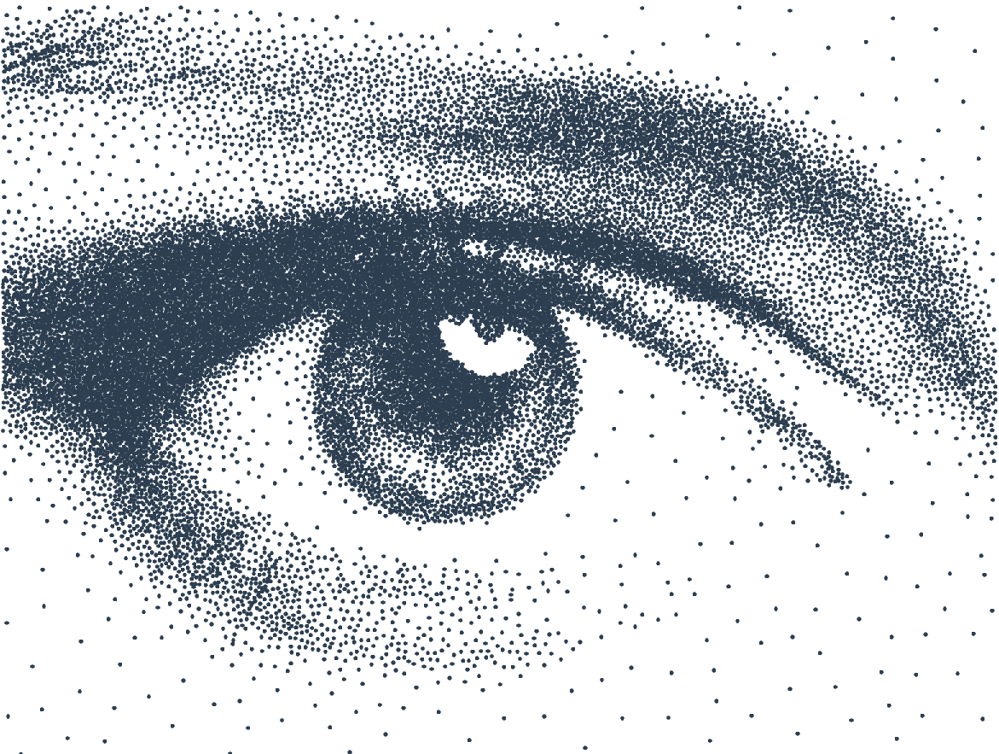
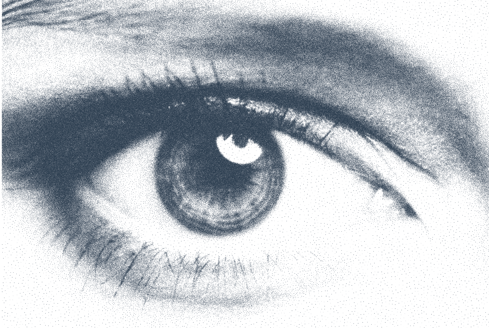
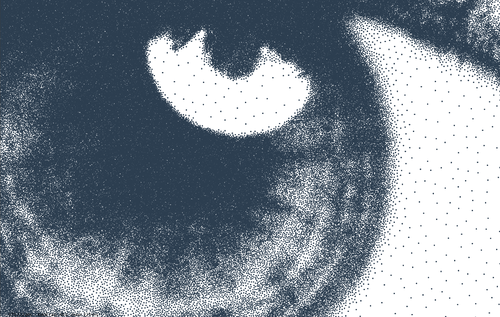

# image_dots

Processing sketch that converts an image into a point cloud using **variable-density Poisson Disk Sampling**.

New to the algorithm? Read the plain-English walkthrough: [ALGORITHM_POINTS.md](ALGORITHM_POINTS.md) (also available [in French](ALGORITHME_POINTS.md)).

---

## Getting a Release

No Processing, Java, or ControlP5 installation is required to run a release build — everything needed is bundled in the zip.

1. Download the release zip (see `releases/` or wherever it was shared with you).
2. Unzip it anywhere.
3. Run the `.exe` inside — that's it.

---

## Examples

### Eye — default settings

| Source | Result |
|--------|--------|
|  |  |

**Parameters:** density=`0.59` · contrast=`14.15` · gamma=`1.98` · min_value=`22.10` · max_value=`196.35`

---

### Eye — high density (`huge_eye` preset)

Same source image, higher density and larger canvas — full result and centre crop.

| Full frame | Centre crop |
|------------|-------------|
|  |  |

**Parameters:** density=`1.60` · contrast=`14.15` · gamma=`1.98` · min_value=`22.10` · max_value=`196.35`

---

## Usage Tips

- A `contrast` ratio of **5 to 15** gives balanced results. Beyond 20, bright areas become nearly empty.
- `gamma > 1` (e.g. 2–3) protects midtones and avoids an overly abrupt transition between dark and bright.
- `min_value` / `max_value` allow cropping the tonal range of the image without external editing.
- `threshold` at 240–250 is enough to clear residual points in near-white areas without disturbing midtones.
- In **Polygon** mode, `sides = 3` gives triangles, `sides = 6` hexagons — well suited for plotters.

---

## Dots Parameters

| Parameter | Default | Role |
|-----------|---------|------|
| `density` | 0.5 | Base density — `r_min = 1 / density` |
| `contrast` | 10 | `r_max / r_min` ratio — gap between dark and bright areas |
| `gamma` | 1.0 | Density curve: `> 1` spreads midtones, `< 1` compresses them |
| `min_value` | 0 | Pixels below this are treated as black (dense) |
| `max_value` | 255 | Pixels above this are treated as white (empty) |
| `invert` | false | Invert: bright areas become dense |
| `threshold` | 255 | Hard cutoff, measured from the "empty" extreme (white normally, black when `invert` is on): pixels past it get no point at all, regardless of `contrast` |
| `seed` | 42 | Random seed |

## Shape Parameters

| Parameter | Default | Role |
|-----------|---------|------|
| `mode` | Point | `Point` or `Polygon` |
| `sides` | 6 | Number of sides of the regular polygon |
| `size` | 3.0 | Polygon radius (in px) |

## Sort Parameters

Sorting is always applied automatically once point generation completes (no `enabled` toggle) — see [Automatic Triggering](DEVELOPMENT.md#automatic-triggering).

| Parameter | Default | Role |
|-----------|---------|------|
| `hex_size` | 10 | Hexagon cell radius in pixels |

---

For the algorithm details, file architecture, and how to build a release yourself, see [DEVELOPMENT.md](DEVELOPMENT.md).

---

## Changelog

### 2026-08-26
- **Invert swaps Line/Background color**: clicking the `invert` toggle (Dots tab) now also swaps `Style.lineColor` and `Style.backgroundColor` (`Style.swapLineBackground()`, new method on the shared `Style` class in `xLib_Style.pde`). Toggling back and forth is lossless — the swap is its own inverse.
- **Fix**: `threshold` now follows `invert`. It used to always reject pixels brighter than the cutoff, even with `invert` on — where dark areas are the dense ones and bright areas are meant to be filtered out, not kept. `_getRLocal()` now measures the cutoff from whichever extreme is currently "empty" (white normally, black when `invert` is on).

### 2026-08-22
- **Debug tab**: new `DataDebug` + `DebugGUI` — tools to observe the point-generation propagation for producing illustrations: *Pause* (freezes generation), *Slow Mode* + *Steps / Frame* (caps `resume()` to a handful of attempts per frame instead of its usual time budget), *Show Active* + *Active Color* (highlights the points still eligible to spawn neighbours, in a configurable colour), *New Seed* (relaunches generation with a fresh random seed without switching to the Dots tab), and *Clear* (empties the point cloud without relaunching — use *New Seed* afterwards to regenerate). Display/pacing-only — the resulting point cloud is unchanged. *Active Color* uses the same swatch picker as the Style tab (`ColorGroup`), not ControlP5's `ColorPicker` — tried first, but its object/field reflection binding silently never writes back to the target field.

### 2026-08-19
- **Load / Save**: no longer opens a separate OS file-picker window (which could occasionally open hidden behind the main window) — replaced by an in-app file browser in the **Files** tab. Load and "Save as..." now show buttons for every settings file and folder inside `Settings/`, with a `..` button to go up a level and Prev/Next if there are many files. Saving over an existing file asks for confirmation first; saving under a new name uses a text field pre-filled with the current file's name.
- **Clip Ratio**: the Files tab's clipping controls gained a ratio lock — pick `None` (free width/height, as before), `A4`, `16:9`, `4:3`, `Raisin`, or `1:1`, plus a `Landscape`/portrait toggle. With a ratio selected, dragging either the width or height slider keeps the other in proportion automatically.
- **`export_app.ps1`**: new build script — exports the sketch as a standalone application (embeds a JRE and all libraries, including ControlP5), copies `Settings/` into the export (not included by `processing-java --export`, and required at startup), and zips the result into `releases/` as a ready-to-share release. Same script copied verbatim across projects, same convention as the shared `xLib_*.pde` files.
- **README**: added a "Getting a Release" section (download, unzip, run) at the top; split implementation/algorithm details and the build procedure out into a new [DEVELOPMENT.md](DEVELOPMENT.md).
- **`.gitignore`**: ignore `build_*/` and `releases/` (generated build output).

### 2026-05-11
- **Sort tab**: new `DataSort` + `SortGUI` — hexagonal spiral sort (`DotsSort`) to optimise plotter travel order.
- **DotsSort**: points assigned to axial hexagonal cells, visited ring by ring in a spiral; nearest-neighbour within each cell; transitions start from last visited point for smooth inter-cell jumps.
- **Visualisation**: *Draw path* (rainbow gradient) and *Draw hex transitions* (hex outlines + yellow centre-to-centre lines) to inspect the sort result.
- **Export**: sorted order used automatically when sort is enabled and complete.

### 2026-05-09
- **Threshold (hard cutoff)**: added the `threshold` parameter to `DataDots` and its corresponding slider. Any candidate whose pixel exceeds the threshold is immediately rejected in `_getRLocal`, before `r_local` is computed. Cleans up the few residual points that appear in fully white areas despite a high `contrast` value.

### 2026-05-07
- **README**: complete rewrite to reflect the actual state of the code (log-linear formula, architecture, exact parameters, tips).
- **Fix**: removed a residual static value in `DataDots`.
- **Progressive HUD**: displays point count and computation time in real time during generation (`totalCalcMillis`, `lastResumeMillis`). Added `StringUtils.formatDuration()` and `StringUtils.formatInt()`.

### 2026-05-06
- **Variable-density Poisson (Direction B)**: complete overhaul of `DotsGenerator`. No longer filtering a uniform distribution — the final distribution is generated directly by computing a `r_local` for each candidate from the brightness of the pixel beneath its position.
- **Log-linear mapping**: `r_local = r_min × contrast ^ (t_norm ^ gamma)`. Replaces the initially planned linear mapping — each brightness step multiplies `r` by the same factor across the entire tonal range.
- **`density` parameter**: replaces `r_min` as GUI input (`r_min = 1 / density`), more intuitive.
- **`contrast` parameter**: `r_max / r_min` ratio, replaces an absolute `r_max`.
- **`min_value` / `max_value` parameters**: tonal range clamp before normalisation — allow targeting a sub-range of the histogram.
- **`invert` parameter**: inverts `t_norm` so that bright areas become dense.
- **Removed `DotsFilter`**: the post-processing filter and `DataFilter` are removed — unnecessary with direct generation.
- **`DotsRenderer`**: rendering extracted into a dedicated class, separate from the generator. Supports `Point` mode and `Polygon` mode (regular polygon centred on each point).
- **`DataShape`**: new `mode`, `sides`, `size` rendering parameters, with a dedicated GUI tab.
- **Adapted spatial grid**: cell = `r_min / √2`, inspection radius = `ceil(r_max / cell) + 1` to cover all neighbours even when `r_max >> r_min`.

### 2026-05-04
- **Progressive generation** (`resume()`): Poisson generation is performed in 500 ms slices to avoid blocking the interface.
- **`DataShape` + `DotsRenderer`** (v1): first addition of regular polygon rendering.
- **Comments**: documentation of `DotsGenerator` and `DotsFilter`.

### 2026-05-02
- **First files**: Processing setup, image centering, PDF/SVG/DXF export.
- **Point grid**: first implementation of uniform Poisson Disk Sampling with spatial grid.
- **Uniform density**: basic `density` parameter.
- **Seed**: `seed` parameter for reproducibility.
- **Filtre binaire** (`DotsFilter`) : premier filtre de post-traitement — suppression des points au-dessus d'un seuil de luminosité.
